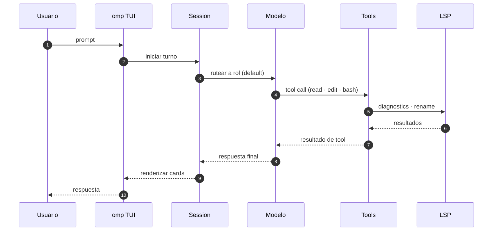
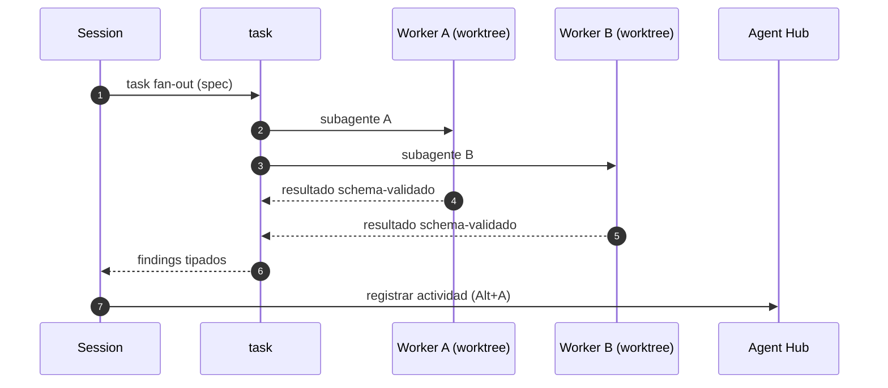
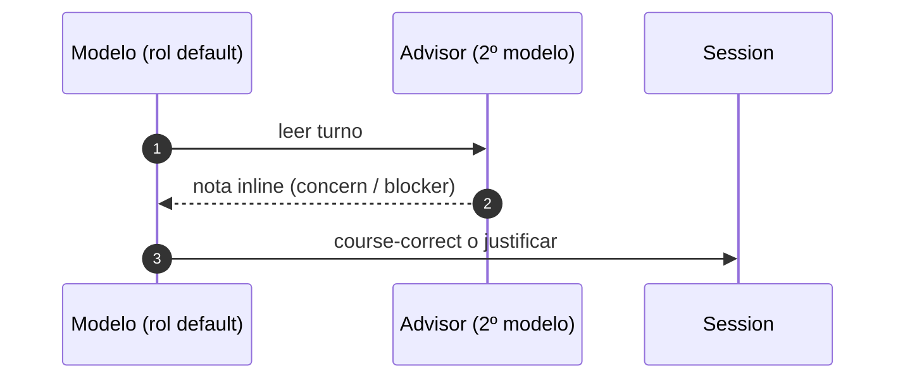

# omp (oh-my-pi) — Coding Agent

## Hallazgos

omp (oh-my-pi) es un coding agent de terminal escrito por can1357 (Can Bölük), fork de Pi de Mario Zechner (pi-mono). Repo: github.com/can1357/oh-my-pi, landing: omp.sh, paquete npm: @oh-my-pi/pi-coding-agent.

Núcleo Rust nativo (~80k líneas), 60+ providers, 31 tools built-in, 14 LSP ops, 28 DAP ops. Windows-native (sin WSL), también macOS y Linux.

Características distintivas:
- Code execution con tool-calling: Python persistente + Bun worker con bridge loopback.
- LSP wired en cada write: renames via workspace/willRenameFiles, actualiza re-exports e imports.
- DAP (debugging): 28 operaciones de debug.
- Time-traveling stream rules: reglas que se inyectan solo cuando el modelo se desvía.
- web_search con 23 providers rankeados: lee PDFs de arxiv, GitHub pages, Stack Overflow como markdown.
- Nativo: ripgrep, glob, find in-process; brush como bash con 58 utilidades CLI.
- Code review con prioridades P0-P3 y veredicto.
- ask tool: option picker estructurado para ambigüedad.
- SDK embebible en Node: expone ModelRegistry, SessionManager, createAgentSession.

Configuración:
- ~/.omp/agent/config.yml — settings globales + roles de modelo
- ~/.omp/agent/models.yml — registro de providers y modelos custom
- ~/.omp/agent/sessions/ — sesiones como JSONL
- Memory backends: local, hindsight, mnemopi

Instalación:
- curl -fsSL https://omp.sh/install | sh
- brew install can1357/tap/omp
- bun install -g @oh-my-pi/pi-coding-agent (recomendado)
- nix run github:can1357/oh-my-pi

Relación con el codebase: omp ya está integrado en zsh/modules/ai/ (config/omp.zsh, internal/omp.zsh, pkg/omp.zsh) con ZSH_AI_OMP_CONFIG_PATH=~/.omp/agent.

### Nuevos hallazgos (enriquecimiento 2026-09-06)

Repo: 29.8k stars, 21,390 commits, MIT license. "A coding agent with the IDE wired in."

Features adicionales (README):
- Subagents first-class: task hace fan-out en worktrees aislados, resultados schema-validados; Agent Hub (Alt+A) para supervisar/revivir/matar workers.
- Advisor: segundo modelo que lee cada turno e inyecta notas inline (concern/blocker).
- /collab: sesión en relay con link + QR; omp join o browser; view = read-only.
- Hashline edit: edición por content-hash anchors; rechaza patches sobre archivos stale.
- GitHub como filesystem: read pr://1428, grep sobre diffs, agent://<id>/findings.0.path.
- Memory curada por el agente: retain/learn/recall/reflect; backends local, Hindsight, Mnemopi; project-scoped.
- ACP: agente driveable desde Zed (lee buffer, escribe por save path del editor, shells en terminal del editor).
- Hereda configs de otros agentes: Cursor MDC, Cline .clinerules, Codex AGENTS.md, Copilot applyTo.
- omp commit: splits atómicos ordenados por dependencias; ciclos rechazados; lock files excluidos.
- Conflict resolution: conflict://N con @theirs/@ours/@base; bulk conflict://*.
- ast_edit preview → xd://resolve (Accept card, move atómico).
- Browser real: eval browser.open(...) con tab runtime; stealth default; relay adopta tabs de Chrome.
- Desktop: computer.window/win.screenshot/win.ax/el.press; control del host real (sin DOM).
- security_scan: reviews nativos de seguridad (Codex Security cloud).

Tool surface (31 built-in):
- Files & search: read (archivos, dirs, SQLite, PDFs, notebooks, URLs, ssh://, schemes internos), write, edit (hashline), ast_edit, ast_grep (50+ grammars), grep, glob.
- Runtime: bash (46 coreutils in-process, PTY opcional, background jobs), eval (Python/JS persistentes con tool re-entry).
- Code intelligence: lsp (diagnostics, navigation, symbols, renames, code actions), debug (DAP), security_scan.
- Coordination: task, hub, todo, ask.
- Desktop & web: browser, computer, web_search, github, generate_image, tts.
- Memory & skills: checkpoint, rewind, retain, recall, reflect, memory_edit, learn, manage_skill.
- Setting-gated off by default: github, security_scan, generate_image, tts, checkpoint, rewind, memory tools.

Providers (60+):
- 9 roles: default, smol, slow, plan, commit, vision, task, advisor, tiny. Override con --smol/--slow/--plan; Ctrl+P cicla modelos; /model cambia en sesión.
- Frontier APIs: Anthropic (oauth), OpenAI, OpenAI Codex (oauth), Gemini, Vertex, Antigravity (oauth), xAI, SuperGrok (oauth), DeepSeek, Mistral, Groq, Cerebras, Fireworks, Together, Baseten, DeepInfra, Hugging Face, NVIDIA, Meta, Bedrock, Azure OpenAI, SiliconFlow, GMI Cloud, CoreWeave, Sakana AI, OpenRouter, Synthetic, Vercel AI Gateway, Cloudflare AI Gateway, Wafer Serverless.
- Coding plans: Cursor (oauth), GitHub Copilot (oauth), GitLab Duo, Devin (oauth), Kimi Code, Moonshot, MiniMax, Alibaba, Qwen Portal (oauth), Z.AI/GLM, Xiaomi MiMo, Qianfan, Umans, NanoGPT, Novita, Venice, Kilo, ZenMux, OpenCode Go, OpenCode Zen.
- Local: Ollama, Ollama Cloud, LM Studio, llama.cpp, vLLM, LiteLLM.
- Custom: ~/.omp/agent/models.yml (baseUrl, api: openai-completions/responses/codex, anthropic-messages, bedrock-converse-stream, google-generative-ai, etc.); modelRoles.default en config.yml.
- Routing: fallback chains por rol/modelo (429/quota), path-scoped models (enabledModels/disabledProviders con path:), round-robin credentials con session affinity.

web_search: 23 backends (auto chain: perplexity, gemini, anthropic, codex, xai, zai, exa, tinyfish, jina, kagi, tavily, firecrawl, brave, kimi, parallel, synthetic, searxng, duckduckgo, startpage, google, ecosia, mojeek, public). Handlers especializados: github/gitlab, npm/PyPI/crates.io/Hex/Hackage/NuGet/Maven/RubyGems/Packagist/pub.dev/Go, arxiv/semantic scholar, stack overflow/reddit/hn, mdn/readthedocs/docs.rs. Security DBs: NVD, OSV, CISA KEV.

Rust core (~80k líneas, 6 crates + N-API addon):
- pi-shell (38k): bash embebido, sesiones persistentes, coreutils in-process, minimizer.
- pi-natives (25k): superficie N-API (desktop 10.6k, grep 3.3k, text 2.1k, snapcompact 1.8k, keys 1.7k, ast 1.5k, diff 1k, pty 630, crash_handler 610, highlight 550, appearance 450, task 440, glob 430, fd 385, clipboard 370, workspace 275, power 270, prof 240, file_lock 210, ps 195, tokens 70, html 60, sixel 55).
- pi-walker (5.2k): walker paralelo ignore-aware + scan cache.
- pi-iso (3.3k): workspace isolation (apfs, btrfs, zfs, reflink, overlayfs, projfs, rcopy).
- pi-ast (2.9k): tree-sitter + ast-grep, block resolution, structural summaries.
- pi-voice (1k): audio capture/playback, Opus, WebRTC.
- Plataformas: linux-x64/arm64, darwin-x64/arm64, win32-x64/arm64 (x64 dual AVX2/baseline).

Entry points: TUI (default), omp -p (one-shot), Node SDK (embebe sesión), --mode rpc y omp acp (stdio).

Magic keywords (solo en prosa): ultrathink, orchestrate, workflowz.

Slash commands: /vibe (modo director con workers fast/good read-only), /fresh (reset provider stream), /model, /review, /collab, /advisor.

Instalación adicional: nix flake (packages.<system>.omp, overlays.default, nixosModules.default, homeManagerModules.default con programs.omp.enable), Windows PowerShell (irm https://omp.sh/install.ps1 | iex), mise (mise use -g github:can1357/oh-my-pi). Completions: omp completions bash/zsh/fish.

## Diagramas de secuencia

### Bucle del agente

### Subagent fan-out (task)

### Advisor (segundo modelo)

## Fuentes

- https://github.com/can1357/oh-my-pi
- https://omp.sh/
- https://www.npmjs.com/package/@oh-my-pi/pi-coding-agent
- https://acchapm1.github.io/tutorials/Oh-My-Pi/omp-beginner-guide
- https://omp.sh/docs/tools
- https://omp.sh/docs/providers
- https://blog.can.ac/2026/02/12/the-harness-problem/
- https://github.com/can1357/oh-my-pi/blob/main/docs/lsp-config.md
- https://github.com/can1357/oh-my-pi/blob/main/docs/agent-hub.md
- https://github.com/can1357/oh-my-pi/blob/main/docs/magic-keywords.md
- https://github.com/can1357/oh-my-pi/blob/main/docs/vibe-mode.md
- https://github.com/can1357/oh-my-pi/blob/main/docs/session-operations-export-share-fork-resume.md